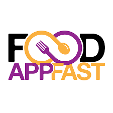

<h1 align="center"><strong>🍴 FOOD APP FAST</strong></h1>

<p align="center">
  
</p>

<p align="center">
  <strong>ReactJS project with real-time data fetching from Swiggy API and data-driven UI rendering.</strong>
</p>

---

## 🚀 Project Overview

**Food App Fast** is a frontend application built using **ReactJS** and bundled with **Parcel**. It fetches real-time restaurant and food data from Swiggy’s public API and renders a dynamic, component-based UI.

This project was created to strengthen my understanding of **React hooks**, **data fetching**, and **component-based design** through hands-on experience.

---

## 🛠 Tech Stack

- ReactJS
- JavaScript (ES6+)
- Parcel (Bundler)
- Swiggy API (Unofficial)
- CSS / Flexbox

---

## 💡 Key Highlights

- Live API data rendering
- Search & filter restaurants
- Modular React components
- Responsive layout
- Built for learning & showcasing frontend skills

---

## 🚀 Run Locally

```bash
git clone https://github.com/yourusername/food-app-fast.git
cd food-app-fast
npm install
npm start
```

---

<p align="center"><strong>Crafted with ❤️ while learning ReactJS</strong></p>
